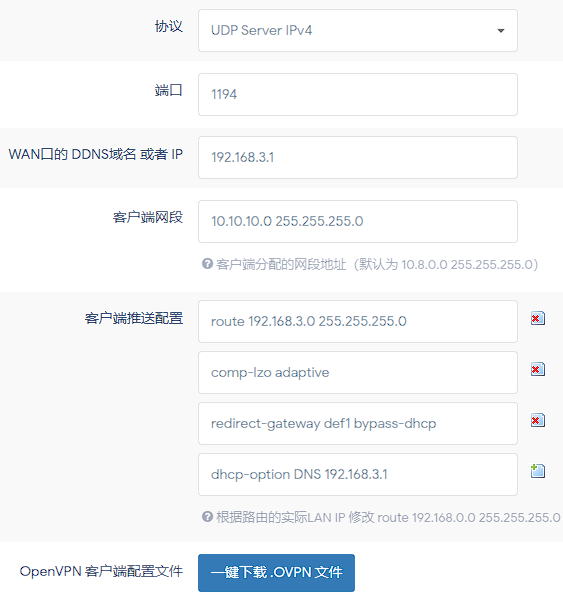

## 开始前测试

1.连接校园网，但不要进行认证，

2.打开Windows电脑，按住Ctrl+R，输入“cmd”然后回车，在弹出的黑色窗口内执行以下命令，或使用linux终端执行以下命令

```
nslookup baidu.com
```

3.如果正常返回了IP地址，则证明该方法对你有效


## 开始配置
1.打开OpenVPN管理界面，修改配置如下，但不要启用

2.如果你的OpenWRT管理地址不是192.168.3.1，则需将图内对应的配置修改为你的OpenWRT管理地址

3.“WAN口的 DDNS域名 或者 IP”请设置为你WAN口的DDNS域名或IP，否则将要修改客户端配置文件，建议使用静态IP，或使用DDNS域名绑定，如果是内网IP请在DDNS的全局设置中打开“允许非公网IP”



2.由于OpenVPN默认使用的证书是公开的，所以我们要更改为自己的证书，使用SSH连接到OpenWRT，然后执行下方命令

```
curl https://raw.githubusercontent.com/QiYueYiya/OpenWrt-Actions/main/.github/data/crt.sh | sh
```

3.启用OpenVPN，保存并应用后，点击下方的“一键下载.OVPN文件”，将文件导入到OpenVPN APP中，然后点击对应的配置文件即可连接，请注意：部分手机在连接到WiFi时，如果当前WiFi无网络，则会切换为流量上网，从而无法访问WiFi内网来连接OpenVPN服务器，请自行调整手机设置

